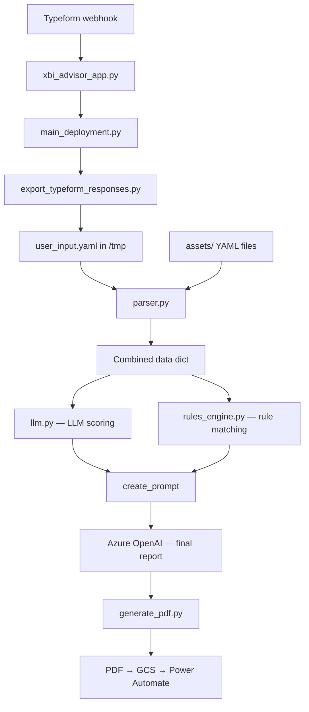
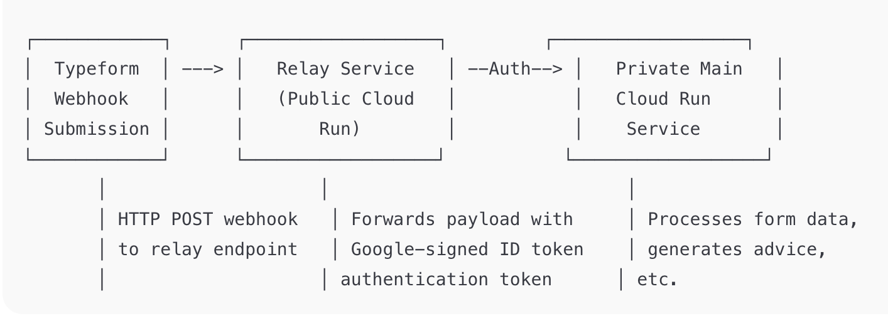

# xbi-advisor — architecture

## Overview

Rules fire first. Semantic matching fills the gaps rules can't express as exact conditions. Then an LLM writes the final report — explaining only what the layers below it detected, nothing more.

## Module breakdown

- **`xbi_advisor_app.py`** — FastAPI entry point deployed on Cloud Run. Receives Typeform
  webhooks, deduplicates requests, and schedules background processing.

- **`main_deployment.py`** — Pipeline orchestrator. Takes a Typeform webhook payload from ingestion
  to delivery: parses responses, runs the rules engine, calls the LLM, generates a PDF, uploads to
  GCS, and triggers Power Automate.

- **`rules_engine.py`** — Deterministic rules engine. Loads rules from `assets/rules/rules.yaml`
  and matches them against user input using either exact string comparison or sentence-transformer
  embeddings (`semantic_similarity: true`).

- **`engine.py`** — Public library API. `AdvisoryEngine` wires `RulesEngine` + any `LLMClient`
  into a single `advise()` call. The LLM receives only the prompt built from matched rules.

- **`llm.py`** — Azure OpenAI integration and Jinja2 prompt rendering for the production pipeline.

- **`parser.py`** — Loads and deep-merges all YAML files from `assets/` and the runtime temp
  directory into a single flat dict consumed by the rules engine and LLM modules.

- **`export_typeform_responses.py`** — Converts raw Typeform JSON answers into structured YAML
  files in the temp directory.

- **`generate_pdf.py`** — Converts the final markdown advisory report to a styled PDF using
  WeasyPrint.

## Data flow



## Assets directory

```
xbi_advisor/assets/
├── rules/
│   └── rules.yaml          # Deterministic matching rules
├── templates/
│   ├── scores_template.md  # Jinja2 prompt for LLM scoring
│   └── recommendation_template.md  # Jinja2 prompt for final advice
├── images/                 # Charts and logos embedded in PDF output
└── properties/             # YAML files with BI tool capability data
```

## Deployment architecture

The production service uses a relay pattern to keep the main Cloud Run service private:

```
Typeform → Public Relay (Cloud Run) → Authenticated call → Private Main Cloud Run
```



The relay accepts webhook calls from Typeform (unauthenticated), then generates a
Google-signed ID token and forwards the payload to the private main service. This prevents
exposing the advisory pipeline publicly while remaining reachable from Typeform.

See `cloudbuild.yaml` and `deploy.sh` for the build and deployment configuration.
