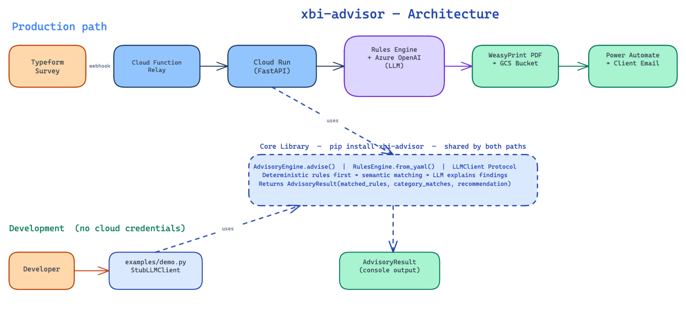

# xbi-advisor


> Rules first, LLMs last — a production pattern for reliable AI recommendations.

LLMs are fluent. They are not reliable. Asking an LLM to diagnose a complex setup gives you answers that vary run-to-run, are too vague to act on, and can't be audited. This project fixes that with a two-layer advisory engine where deterministic rules do the thinking and the LLM does the talking.

To see a real advisory output, browse [`examples/sample_report.md`](examples/sample_report.md).

---

## Quickstart

```bash
uv run --extra demo python examples/demo.py
```

No cloud credentials needed. The demo uses a stub LLM client and the same 34 production rules.

---

## How it works

```
User input (dict)
      │
      ▼
┌─────────────────────────────────────────────────────┐
│  Layer 1 — Rules Engine                             │
│  Deterministic rules evaluate each field.           │
│  Exact match or semantic similarity match.          │
│  If a condition matches → flag it.                  │
│  Auditable. Testable. No LLM involved.              │
└──────────────────────┬──────────────────────────────┘
                       │  matched findings
                       ▼
┌─────────────────────────────────────────────────────┐
│  Layer 2 — LLM                                      │
│  Receives matched findings as a structured prompt.  │
│  Writes the advisory report.                        │
│  Cannot invent findings — only explains them.       │
└──────────────────────┬──────────────────────────────┘
                       │
                       ▼
                 AdvisoryResult
```



### Layer 1 — Rules engine

Every finding in the final report is detected by a rule that evaluates a specific field against a specific condition. Rules can be read, audited, and unit-tested. When a rule fires, you know exactly why: the path, the matched value, and the recommendation are all inspectable in `AdvisoryResult.matched_rules`. Adding a new finding means writing a YAML entry, not touching code.

Rules support two matching modes. **Exact match** is for structured fields (dropdowns, yes/no, tool names). **Semantic similarity** is for free-text fields where phrasing varies — see [Semantic matching](#semantic-matching) below.

### Layer 2 — LLM

Once the rules engine has identified what is wrong, the LLM receives a structured prompt containing only those findings. It cannot introduce new issues. Its job is to turn a list of flagged conditions into a coherent, client-ready advisory narrative — something rules alone cannot do well.

### Why this order matters

The non-determinism of LLMs is confined to the final communication step, where variation in phrasing is acceptable. The analytical judgment — what must be consistent, auditable, and trustworthy — stays fully in the rules layer.

The first version of this system handed diagnostic logic directly to the LLM. The same input produced different recommendations on different days, outputs were too vague to act on, and there was no way to test what the system decided. The rules-first rebuild fixed all three.

### Semantic matching

Survey respondents don't write the same answer twice. "We barely use dashboards", "reports are rarely looked at", and "BI adoption is very low" all express the same finding, but none would match a rule written as `match: "infrequent BI usage"` using exact comparison.

When a rule sets `semantic_similarity: true`, the engine uses a sentence-transformer model (`all-MiniLM-L6-v2`) to convert both the expected phrase and the user's actual answer into vector embeddings, then computes cosine similarity. If the score exceeds 0.7 (configurable via `RulesEngine.set_similarity_threshold()`), the rule fires.

Multi-value answers are handled correctly: if a user selects multiple options ("Data quality issues, Manual reporting, Slow dashboards"), each segment is evaluated independently so one strong match doesn't get diluted by the others.

The model loads once at startup and is shared across all `RulesEngine` instances via a class-level cache (`RulesEngine._model_cache`). No reload after startup.

---

## Using the library

### Basic usage

```python
from xbi_advisor import AdvisoryEngine, RulesEngine, StubLLMClient

engine = AdvisoryEngine(
    rules_engine=RulesEngine.from_yaml("path/to/rules.yaml"),
    llm_client=StubLLMClient(),   # swap for your LLM client in production
)

result = engine.advise({
    "ecosystem": {"current_bi_tool": "Power BI", "platform": "Microsoft Azure"},
    "maturity_level": {"data_literacy": "Advanced: ..."},
})

print(result.recommendation)
for rule in result.matched_rules:
    print(f"  [{rule['id']}] {rule['recommendation']}")

# Async variant — use in FastAPI endpoints
result = await engine.aadvise(user_input_dict)
```

### Plugging in your LLM

`LLMClient` is a Python `Protocol`. Any class with a `complete(prompt: str) -> str` method qualifies — no inheritance required.

```python
from xbi_advisor import AdvisoryEngine, RulesEngine

class MyOpenAIClient:
    def complete(self, prompt: str) -> str:
        return my_openai_call(prompt)

engine = AdvisoryEngine(
    rules_engine=RulesEngine.from_yaml("rules.yaml"),
    llm_client=MyOpenAIClient(),
)
```

For async contexts (FastAPI, async pipelines), implement `AsyncLLMClient` with `async def complete(...)` instead.

### LLM backends

| Context                 | Client                                | Credentials needed                           |
| ----------------------- | ------------------------------------- | -------------------------------------------- |
| Demo / tests            | `StubLLMClient`                       | None                                         |
| Async FastAPI endpoints | `AsyncLLMClient` (implement protocol) | Your LLM provider                            |
| Production (Azure)      | `AsyncAzureOpenAI` in `llm.py`        | `AZURE_OPENAI_API_KEY`, endpoint, deployment |

### API reference

```python
from xbi_advisor import (
    AdvisoryEngine,       # wires rules engine + LLM client into advise()
    RulesEngine,          # loads rules.yaml and matches against user input
    LLMClient,            # Protocol — sync client with complete(prompt) -> str
    AsyncLLMClient,       # Protocol — async variant for FastAPI contexts
    StubLLMClient,        # credential-free sync stub for demos and tests
    AsyncStubLLMClient,   # credential-free async stub
    AdvisoryResult,       # returned by advise() — matched_rules, recommendation
    MatchResult,          # returned by RulesEngine.match() — matched_rules, category_matches
    RuleMatchDict,        # TypedDict: id, recommendation, description, scores
    RiskCategory,         # StrEnum: GOVERNANCE, MATURITY, TOOLING, SECURITY, PROCESS
    Severity,             # StrEnum: LOW, MEDIUM, HIGH, CRITICAL
)

result: AdvisoryResult = engine.advise(user_input_dict)
# result.matched_rules    — list[RuleMatchDict]
# result.recommendation   — LLM-generated advisory text
# result.category_matches — rules grouped by category
```

---

## Writing rules

Rules live in a YAML file. Each rule defines a dot-separated field path, a match condition, and a recommendation:

```yaml
- id: no_data_ownership
  path: data_governance.data_ownership
  match: "no"
  scores:
    governance: 1
  recommendation: "Define clear data ownership to reduce governance risk."
  description: "No data ownership indicates a governance gap."
  semantic_similarity: false

- id: vague_bi_usage
  path: maturity_level.bi_usage
  match: "we use it sometimes"
  scores:
    maturity: 2
  recommendation: "Establish structured BI adoption practices."
  description: "Infrequent or unstructured BI usage suggests low maturity."
  semantic_similarity: true # sentence-transformer fuzzy match
```

Use `semantic_similarity: false` for structured fields (dropdowns, yes/no, tool names). Use `semantic_similarity: true` for open-text fields where phrasing varies — see [Semantic matching](#semantic-matching) above.

Rules are validated by Pydantic on load. Malformed rules fail at startup, not silently at runtime.

---

## Production deployment

### Pipeline

The production system wires the library to a full cloud pipeline:

```
Typeform Survey
      │ webhook
      ▼
Cloud Function (relay)          ← lightweight OIDC auth proxy
      │ authenticated request
      ▼
Cloud Run — FastAPI              ← xbi_advisor_app.py
      │ background task
      ├── Rules Engine + Azure OpenAI LLM    ← core library
      │         │
      │         ▼
      │   WeasyPrint PDF  →  GCS Bucket
      │
      └── Power Automate webhook  →  Client email
```

### Two-service architecture


Two separate Cloud services handle different parts of the stack.

The **Cloud Function relay** (`cloud_function/`) is a minimal, public-facing proxy. Typeform webhooks need a public URL, but exposing the full pipeline is a security risk. The relay receives the webhook, generates an OIDC token, and forwards the authenticated request to the private Cloud Run service. No business logic, ~20 MB Docker image, deploys in seconds.

**Cloud Run** (`xbi_advisor/xbi_advisor_app.py`) runs the actual pipeline. Only requests authenticated by the relay's OIDC token are accepted. This service carries the heavy dependencies (PyTorch, WeasyPrint) in a ~2 GB image. The FastAPI endpoint returns `202 Accepted` immediately and processes the advisory in a background task — Typeform's webhook times out at 30 seconds; the pipeline takes longer.

### Key components

| Component             | File                             | Purpose                                               |
| --------------------- | -------------------------------- | ----------------------------------------------------- |
| FastAPI app           | `xbi_advisor/xbi_advisor_app.py` | Webhook entrypoint, deduplication, background tasks   |
| Pipeline orchestrator | `xbi_advisor/main_deployment.py` | Chains ingestion → rules → LLM → PDF → GCS            |
| Cloud Function relay  | `cloud_function/main.py`         | Lightweight OIDC proxy between Typeform and Cloud Run |
| Dockerfile (app)      | `Dockerfile`                     | Full app image with PyTorch CPU and WeasyPrint        |
| Dockerfile (relay)    | `cloud_function/Dockerfile`      | Minimal relay image (~20 MB)                          |

```bash
./deploy.sh   # builds, pushes, and deploys both Cloud Run services via gcloud
```

---

## Engineering decisions

### Protocol-based LLM client

`LLMClient` and `AsyncLLMClient` are `Protocol` classes, not base classes. Any object with a matching `complete()` method works — no inheritance, no registration. Swap in OpenAI, Anthropic, a local model, or a mock without touching the engine. The `StubLLMClient` used in tests is three lines of code.

### Dynamic rule configuration

Rules are YAML, not Python. A new finding means a new YAML entry, not a code change. Rules load at startup via `RulesEngine.from_yaml()` and can be hot-swapped by pointing to a different file. The full schema (`id`, `path`, `match`, `scores`, `recommendation`, `description`, `semantic_similarity`, `category`) is Pydantic-validated on load.

### Typed return values

`AdvisoryEngine.advise()` returns `AdvisoryResult`, a Pydantic model. `RulesEngine.match()` returns `MatchResult`. Each matched rule is a `RuleMatchDict` TypedDict with known fields. The codebase is statically checked with `ty` — zero errors, zero warnings.

### Sync and async in one class

`AdvisoryEngine` exposes both `advise()` (sync) and `aadvise()` (async). The rules engine always runs synchronously — it's CPU-bound with no I/O. Only the LLM call is awaited in `aadvise()`, keeping the event loop unblocked. A runtime guard raises a `TypeError` if the wrong client type is passed.

### Library vs application

The core library (`engine.py`, `rules_engine.py`, `models/`) has no dependency on Typeform, GCS, PDF generation, or Azure OpenAI. Install it with `pip install -e ".[demo]"` and run it anywhere with `StubLLMClient`. The production application is a client of the library, not part of it.

---

## Tests

18 tests covering the core library, all passing with `-W error` (zero warnings):

```bash
uv run pytest tests/ -v
```

| Test file                       | What it covers                                                                                          |
| ------------------------------- | ------------------------------------------------------------------------------------------------------- |
| `test_rules_engine.py`          | `match()` return type, exact matching, semantic matching, singleton model cache, `aadvise()` type guard |
| `test_advisory_engine.py`       | `advise()` end-to-end, prompt content, no-match case                                                    |
| `test_async_advisory_engine.py` | `aadvise()`, `AsyncLLMClient` protocol conformance                                                      |

---

## Development

```bash
uv sync --extra main --extra dev
uv run pytest tests/
uv run ty check xbi_advisor/engine.py xbi_advisor/rules_engine.py xbi_advisor/models/
```

---

## Roadmap

- [ ] Slack integration (alternative to Power Automate for report delivery)
- [ ] Additional rule backends (DynamoDB, Azure Table Storage)
- [ ] Async demo example using `AsyncStubLLMClient`
- [ ] Rule authoring CLI (`xbi-advisor validate-rules rules.yaml`)

---

## License

Apache 2.0 — see [LICENSE](LICENSE).
